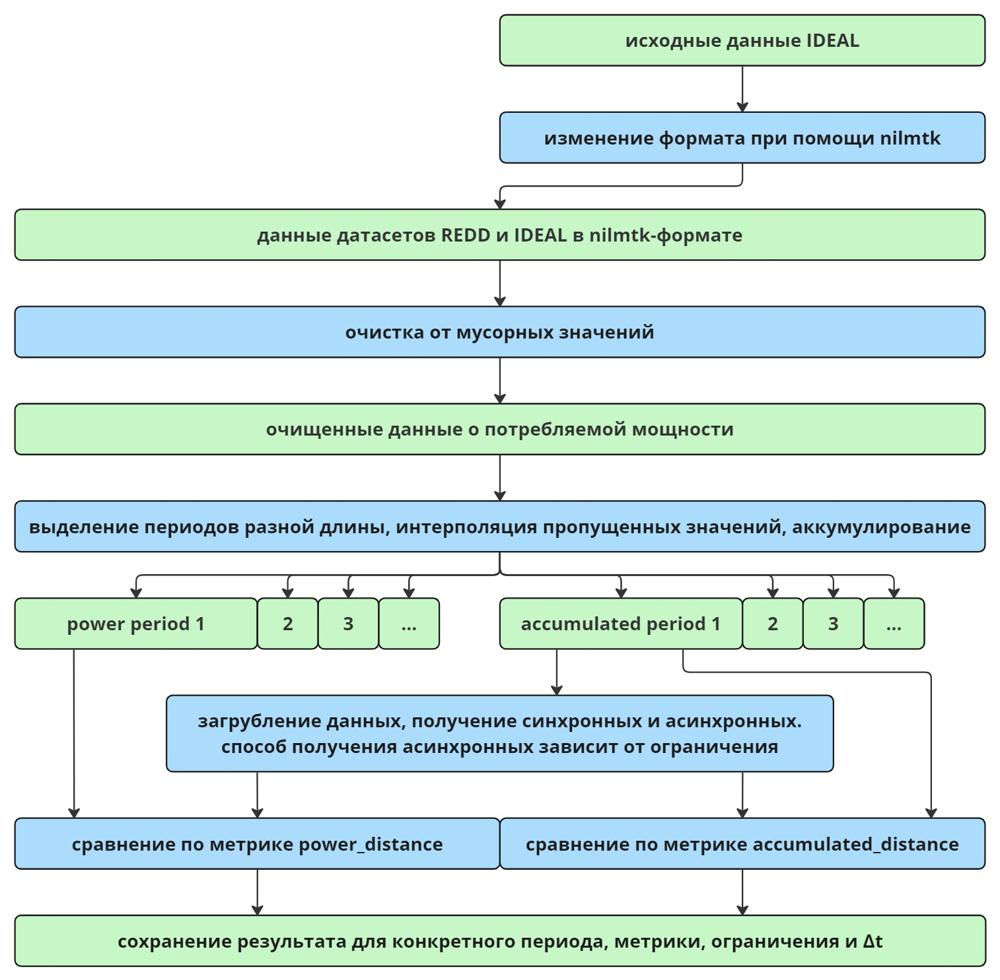

В данном репозитории представлена реализация и результатами экспериментов, поставленных с целью выявления более подходящего формата входного потока данных для цифровой платформы. При сравнении было выяснено, что асинхронный формат подходит больше, чем синхронный. Исследование выполнено в рамках магистерской диссертации.

[Репозиторий с реализацией прототипа цифровой платформы](https://github.com/FilippovIvan19/master_paper_digital_platform), которая также является частью магистерской диссертации. Там же выложен полный текст диссертации

Схема предобработки данных и проведения экспериментов представлена на рисунке ниже
